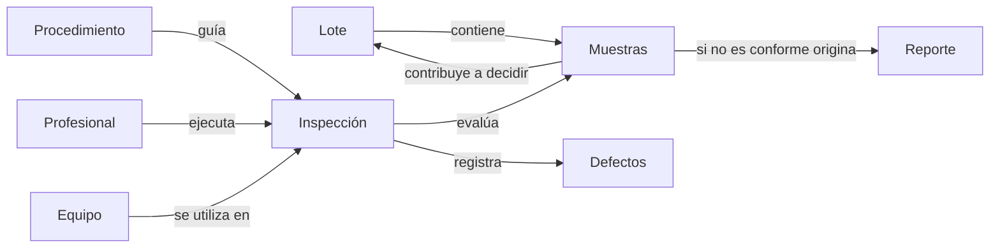
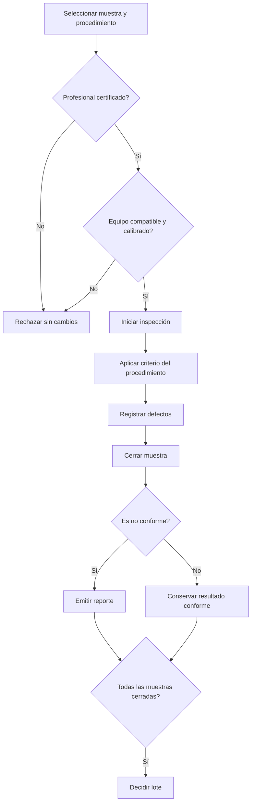

# Trabajo Práctico: Sistema de Monitoreo de Calidad Industrial

## Situación Hipotética

**QuantumTech Precision** fabrica componentes en lotes y evalúa muestras mediante procedimientos de inspección. En la actualidad registra mediciones, calibraciones y defectos en documentos separados: puede utilizar equipos con calibración vencida, cerrar lotes incompletos y producir reportes que no explican qué defectos causaron el rechazo.

La empresa solicita un prototipo que coordine inspecciones reproducibles y determine la conformidad de muestras y lotes. El sistema aplica umbrales definidos; no realiza inferencia estadística Six Sigma, muestreo automático ni análisis de causa raíz.

### Objetivo del sistema

El prototipo deberá permitir:

- registrar lotes, muestras, profesionales, equipos y procedimientos;
- verificar certificaciones y vigencia de calibración antes de inspeccionar;
- ejecutar procedimientos con comportamientos de evaluación diferentes;
- registrar defectos y cerrar muestras mediante transiciones controladas;
- emitir reportes de desviación trazables;
- decidir un lote solo cuando todas sus muestras estén inspeccionadas.

### Alcance y vocabulario del dominio

| Concepto | Representa | Es responsable de | No es responsable de |
| --- | --- | --- | --- |
| Lote | Una partida homogénea de componentes | Identidad, cantidad, muestras y estado | Ejecutar mediciones |
| Muestra | Un subconjunto identificado del lote | Defectos, estado y resultado de conformidad | Calibrar equipos |
| Procedimiento | Una forma definida de inspección | Requisitos y criterio para convertir observaciones en defectos | Aprobar por sí solo el lote |
| Profesional | Quien ejecuta una inspección | Identidad y certificaciones vigentes | Cambiar tolerancias durante una ejecución |
| Equipo | Un instrumento de medición | Identidad, categoría y última calibración | Decidir la conformidad de una muestra |
| Defecto | Una desviación observada | Tipo, descripción y gravedad | Modificar una muestra cerrada |
| Inspección | La ejecución de un procedimiento | Muestra, profesional, equipo, fecha y resultado | Reutilizarse para otra muestra |
| Reporte | El respaldo de una muestra no conforme | Causas, responsable y fecha | Agregar defectos nuevos |

El mapa describe información del negocio y no obliga a implementar una clase por concepto.

### Flujo de inspección

### Convenciones de cálculo

La gravedad es un entero de `1` a `5`, donde `5` es crítica. Cada procedimiento define un límite positivo de gravedad acumulada. Una muestra es `NO_CONFORME` si contiene al menos un defecto crítico o si la suma de gravedades es estrictamente mayor que ese límite. Para decidir el lote se calcula `muestras_no_conformes / muestras_totales * 100`, sin redondear.

### Ejemplo de aceptación

Un lote de `1000` piezas contiene `50` muestras. Todas fueron inspeccionadas: `3` son no conformes y `47` conformes. El porcentaje es `3 / 50 * 100 = 6 %`; como supera el `5 %`, el lote queda `RECHAZADO`. Con `2` muestras no conformes el resultado sería `4 %` y quedaría `APROBADO`.

Una de las tres muestras tiene defectos de gravedad `2` y `4`, y su procedimiento fija límite acumulado `5`: es no conforme porque `2 + 4 = 6 > 5`. Si la suma fuera exactamente `5`, sería conforme salvo que uno de los defectos tuviera gravedad crítica.

### Fuera de alcance

No se requiere interfaz gráfica, persistencia, adquisición automática de mediciones, selección estadística de muestras, gráficos de control, índices sigma, causa raíz, retrabajo, costos ni integración con equipos físicos.

## Requerimientos Técnicos Obligatorios

- Implementar la solución con Programación Orientada a Objetos y separar el punto de entrada de la lógica del dominio.
- Identificar y justificar una jerarquía de herencia que represente una especialización real y una variación polimórfica entre procedimientos que evalúen observaciones de manera diferente.
- Encapsular defectos, estados y decisiones; una muestra o lote no puede cerrarse modificando atributos directamente.
- Definir excepciones propias para datos inválidos, equipo no apto, certificación faltante y transiciones ilegales.
- Implementar manualmente los cálculos de gravedad, porcentajes y agregación de defectos con estructuras nativas.
- Utilizar `date` o `datetime` para calibraciones, certificaciones e inspecciones.
- Escribir pruebas unitarias con `pytest` para criterios, fechas límite, transiciones y consultas.

## Reglas de Negocio

1. **Identidad y cantidades:** Los identificadores de lotes, muestras, profesionales, equipos, procedimientos e inspecciones son únicos dentro de su categoría y no vacíos. La cantidad fabricada y la cantidad de unidades representadas por cada muestra son enteras positivas.
2. **Pertenencia de muestras:** Cada muestra pertenece a exactamente un lote y su identificador no se repite en él. La suma de unidades representadas por sus muestras no puede superar la cantidad fabricada; una muestra no puede moverse a otro lote.
3. **Gravedad válida:** Todo defecto conserva tipo y descripción no vacíos y una gravedad entera entre `1` y `5`, ambos inclusive. Los datos específicos de cada tipo de defecto deben ser coherentes con el procedimiento que lo produjo.
4. **Calibración inclusiva:** Un equipo es apto en una fecha si su categoría coincide con la requerida y su última calibración satisface `fecha_inspeccion - 6 meses <= fecha_calibracion <= fecha_inspeccion`. Para este TP, seis meses se calculan como `182 días`.
5. **Certificación:** Un procedimiento puede exigir una certificación. Para ejecutarlo, el profesional debe poseerla y debe estar vigente de forma inclusiva en la fecha de inspección. Una inspección rechazada por este motivo no modifica la muestra.
6. **Inicio de inspección:** Solo una muestra `PENDIENTE` puede pasar a `EN_INSPECCION`. Antes se validan profesional, equipo y procedimiento. Una muestra admite una única inspección aceptada y los requisitos no pueden cambiar durante esa ejecución.
7. **Evaluación polimórfica:** Cada procedimiento transforma sus observaciones en cero o más defectos mediante su propio criterio. Todos se ejecutan mediante la misma operación observable y no pueden registrar defectos ajenos a la inspección en curso.
8. **Conformidad de la muestra:** Al cerrar, la muestra queda `NO_CONFORME` si tiene un defecto de gravedad `5` o si la suma de gravedades es estrictamente mayor que el límite del procedimiento; en caso contrario queda `CONFORME`. Ambos estados son finales.
9. **Inmutabilidad al cerrar:** Luego del cierre no se pueden agregar, quitar ni reemplazar defectos ni repetir la inspección. Un intento inválido conserva intactos el resultado y los defectos existentes.
10. **Reporte de desviación:** Cerrar una muestra no conforme genera exactamente un reporte con muestra, lote, profesional, fecha y copia inmutable de todos los defectos que determinaron el resultado. Una muestra conforme no genera reporte.
11. **Decisión del lote:** Un lote solo puede decidirse cuando tiene al menos una muestra y todas están cerradas. Queda `RECHAZADO` si el porcentaje no conforme es estrictamente mayor que `5 %`; con exactamente `5 %` queda `APROBADO`. La decisión es final.
12. **Consultas del lote:** El sistema puede obtener cantidad total de defectos críticos y conteos por tipo considerando únicamente muestras cerradas. Estas consultas y el cálculo preliminar del porcentaje no cambian muestras, reportes ni estado del lote.

### Pruebas mínimas esperadas

- identificadores duplicados, cantidades inválidas y muestras que exceden el lote;
- gravedades `1`, `5` y valores fuera del rango;
- calibración exactamente a `182` días y un día vencida;
- certificación ausente, vencida y vigente en sus límites;
- equipo de categoría incompatible;
- suma justo en el límite y por encima, con y sin defecto crítico;
- intento de modificar o reinspeccionar una muestra cerrada;
- contenido y unicidad del reporte;
- lote incompleto, exactamente en `5 %` y por encima;
- conteo de críticos sin efectos secundarios.

### Decisiones de diseño que deberán resolver

- ¿Cómo reciben observaciones distintas los procedimientos sin exponer la representación interna de la muestra?
- ¿Quién valida en conjunto certificación, equipo y estado antes de iniciar?
- ¿Cómo se conserva el contexto de una inspección sin permitir que cambien sus requisitos?
- ¿La conformidad se almacena o se deriva de los defectos? ¿Qué evita contradicciones?
- ¿Cómo se crea una copia estable de las causas de un reporte?
- ¿Dónde se ubica la decisión del lote para no acoplarla a un tipo particular de procedimiento?

No existe una arquitectura única. Se evaluarán invariantes, responsabilidades, extensibilidad y evidencia automatizada.

### Evolución durante el semestre

1. **Registro de calidad:** lotes, muestras, defectos, gravedades y validaciones básicas.
2. **Inspecciones:** profesionales, certificaciones, equipos, calibración y estados de muestra.
3. **Resultados trazables:** conformidad, reportes, cierre y decisión de lotes.
4. **Variación de comportamiento:** al menos dos procedimientos intercambiables, por ejemplo dimensional y visual, con observaciones y criterios propios.
5. **Cambio controlado:** la cátedra seleccionará una extensión —por ejemplo reinspección autorizada, muestreo por severidad o calibraciones por horas de uso— para evaluar la adaptabilidad.

Cada incremento deberá conservar pruebas previas y actualizar brevemente el diagrama y las decisiones afectadas.

## Notas

- Se prohíbe `pandas` y las librerías estadísticas que resuelvan los cálculos evaluados; deberán usar estructuras nativas.
- Antes de codificar, presenten un diagrama de responsabilidades y relaciones; el mapa incluido no prescribe clases.
- Cada implementación deberá estar sustentada y las reglas críticas demostradas mediante pruebas automatizadas.
- Se permite la biblioteca estándar de Python, especialmente `datetime`, sin conexión a dispositivos externos.
