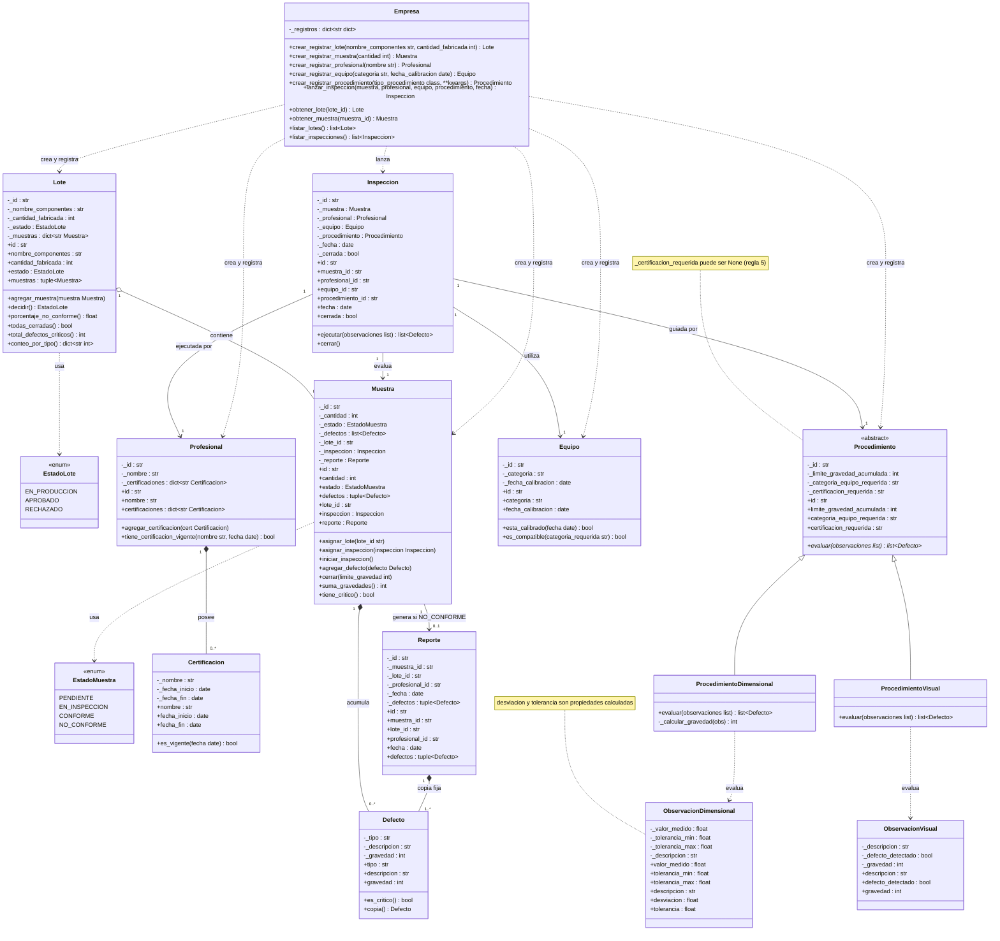

# Trabajo Práctico: Sistema de Monitoreo de Calidad Industrial

## Situación Hipotética

**Empresa de tecnología** fabrica componentes en lotes y evalúa muestras mediante procedimientos de inspección. En la actualidad registra mediciones, calibraciones y defectos en documentos separados: puede utilizar equipos con calibración vencida, cerrar lotes incompletos y producir reportes que no explican qué defectos causaron el rechazo.


## Solución
El equipo presenta un prototipo que coordine inspecciones y determine la calidad de muestras y lotes. El sistema aplica umbrales definidos; y se ocupa de reportar errores o defectos encontrados.

### Objetivo del sistema

El prototipo deberá:

- registrar lotes, muestras, profesionales, equipos y procedimientos;
- verificar certificaciones y vigencia de calibración antes de inspeccionar;
- ejecutar procedimientos diferentes;
- registrar defectos y cerrar muestras mediante modificaciones de estado controladas;
- emitir reportes de desviación trazables (asociado a una muestra y un conjunto de defectos);
- aprobar un lote solo cuando todas sus muestras estén inspeccionadas.


### Arquitectura del Sistema

| Entidad | Representa | Objetivos | 
| --- | --- | --- |
| Lote | Un conjunto de componentes iguales entre sí | Permite a la empresa decidir si está listo o no para su uso. Sus datos permiten crear Muestras | 
| Muestra | Un subconjunto identificado del lote | Defectos, estado y resultado de conformidad | 
| Procedimiento | Interfaz abstracta que define el contrato de inspeccion | Establecer el limite de gravedad acumulada permitida y exigir el método para evaluar observaciones.
| Procedimiento Dimensional| Especialización basada en mediciones físicas. | Comparar valores medidos contra tolerancias (mín/máx) y transformarlos en defectos de tipo "DIMENSIONAL". |
| Procedimiento  Visual | Especialización basada en observación cualitativa. | Registrar descripciones de anomalías estéticas o funcionales y transformarlas en defectos de tipo "VISUAL". |
| Profesional | El operario o técnico de calidad a cargo | Garantizar su propria identidad y validar si posee las certificationes requeridas vigentes en la fecha de la inspeccion | 
| Equipo | El instrumento utilizado para medir o evaluar | Validar que sea la categoria adecuada y certificar que su calibracion no exceda el maximo legal (182 dias). | 
| Defecto | Una anomalía específica hallada durante la evaluación. | Contener de manera inmutable el tipo, la descripción y el nivel de gravedad (escala 1 a 5). | 
| Inspección | El evento transaccional que une todos los elementos. | Coordinar y validar los requisitos (certificación, calibración, estados) de forma previa, bloqueando el contexto durante la ejecución. | 
| Reporte | El documento de respaldo oficial ante un rechazo. | Congelar une "foto" inalterable con las causas (defectos), fecha y responsable de cualquier muestra que resulte NO_CONFORME | 

### Estructura del Repo

Se detalla la función de cada archivo y clase dentro del proyecto como si ya estuviese completamente implementado:


#### 1. Utilidades y Configuración Base

- **`excepciones.py`**: Define excepciones de dominio personalizadas (ej. `DatosInvalidosError`, `TransicionIlegalError`, `CalibracionVencidaError`, `CertificacionFaltanteError`).

#### 2. Entidades de Calidad (Dominio)
- **`defecto.py` (`Defecto`)**: Representa una desviación observada. Encapsula el tipo, descripción y gravedad (1 a 5, donde 5 es crítico). Es inmutable tras su creación.
- **`muestra.py` (`Muestra`)**: Representa un subconjunto del lote. Controla sus propios estados (`PENDIENTE`, `EN_INSPECCION`, `CONFORME`, `NO_CONFORME`). Es la encargada de agrupar defectos e impedir modificaciones una vez cerrada.
- **`lote.py` (`Lote`)**: Representa una partida de componentes. Valida que las muestras le pertenezcan y no excedan su capacidad. Calcula si el lote es `APROBADO` o `RECHAZADO` evaluando el % de muestras no conformes (> 5%).
- **`reporte.py` (`Reporte`)**: Generado automáticamente y de forma inmutable cuando una muestra se cierra como `NO_CONFORME`. Almacena una copia estática de las causas (defectos), responsable y fecha.

#### 3. Actores y Recursos
- **`profesional.py` (`Profesional`)**: Representa al inspector. Conoce su identidad y gestiona sus certificaciones, pudiendo validar si posee una certificación vigente para la fecha requerida.
- **`equipo.py` (`Equipo`)**: Representa un instrumento de medición. Valida si es de la categoría correcta y si su calibración está vigente (no más de 182 días de antigüedad respecto a la fecha de inspección).

#### 4. Motor de Inspecciones
- **`inspeccion.py` (`Inspeccion`)**: Coordina el proceso. Relaciona la `Muestra`, el `Profesional`, el `Equipo` y el `Procedimiento`. Se encarga de validar los requisitos cruzados *antes* de iniciar (profesional certificado, equipo calibrado) y bloquea el contexto para que no cambien durante la ejecución.

#### 5. Procedimientos y Polimorfismo
- **`procedimiento.py` (`Procedimiento`)**: Clase abstracta (interfaz) que define el comportamiento esperado de cualquier inspección. Contiene el límite de gravedad acumulada y define el método polimórfico `evaluar(observaciones)`.
- **`proc_dimensional.py` (`ProcedimientoDimensional`)**: Hereda de `Procedimiento`. Evalúa observaciones basadas en medidas numéricas (valor medido vs tolerancias min/max) y genera defectos de tipo "DIMENSIONAL".
- **`proc_visual.py` (`ProcedimientoVisual`)**: Hereda de `Procedimiento`. Evalúa observaciones visuales de los operarios y genera defectos de tipo "VISUAL".

#### 6. Ejecución y Pruebas
- **`main.py`**: Punto de entrada del programa. Ejecuta una simulación completa (End-to-End) creando lotes, asignando muestras, ejecutando inspecciones visuales y dimensionales, y mostrando por consola el veredicto final.

#### 7. Directorio de Tests (`/tests`)
Pruebas automatizadas construidas con `pytest` que garantizan el cumplimiento de las 12 reglas de negocio:
- **`test_validacion.py`**: Pruebas unitarias de las funciones de validación de datos base.
- **`test_defecto.py`**: Pruebas de la creación, inmutabilidad y límites de gravedad (1-5).
- **`test_muestra.py`** y **`test_estado_muestra.py`**: Pruebas de los estados (PENDIENTE, EN_INSPECCION, etc.), manejo de defectos y cálculo de conformidad.
- **`test_lote.py`** y **`test_estado_lote.py`**: Pruebas de la agregación de muestras, porcentajes de no conformidad y la decisión final de aprobación o rechazo.
- **`test_profesional.py`** y **`test_certificacion.py`**: Verificación de identidades y límites de vigencia de las certificaciones en la fecha de inspección.
- **`test_equipo.py`**: Verificación de categorías compatibles y del cálculo de calibración en el límite de los 182 días.
- **`test_procedimeinto.py`**: Comprobación del polimorfismo entre los distintos métodos visuales y dimensionales. *(Nota: archivo escrito como 'procedimeinto' en el respositorio)*.
- **`test_inspeccion.py`**: Pruebas de validación cruzada antes de iniciar la evaluación, asegurando que el contexto se congele durante la ejecución.
- **`test_reporte.py`**: Validación de la generación de la copia estática e inmutable de los defectos cuando una muestra resulta rechazada.

---

## Cómo ejecutar (Simulación)

Dado que es un sistema Core sin UI, la ejecucion se realiza corriendo el flujo principal o los tests:

1. Instalar dependencias para pruebas (solo se requiere `pytest`):
   ```bash
   pip install pytest
   ```
2. Ejecutar la suite de pruebas automatizadas:
   ```bash
   pytest
   ```
3. Ejecutar la simulación completa del flujo:
   ```bash
   python main.py
   ```

---
## Diagrama 



